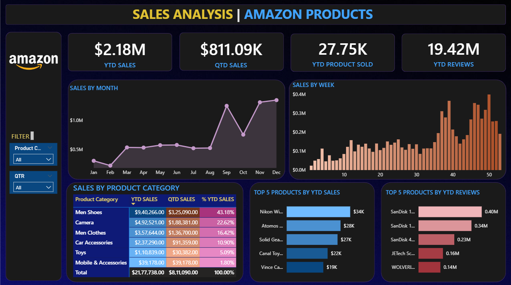

# 📊 Amazon Sales Analysis | Power BI Project

This project showcases an end-to-end data analysis of Amazon Global Sales using **Power BI**. The goal was to derive meaningful business insights by transforming raw sales data into a visually rich, interactive dashboard.

---

## 🎯 Objective

To analyze Amazon's international sales performance and uncover patterns, trends, and key metrics that drive business decisions.

---

## 🛠️ Tools Used

- **Power BI Desktop** – for data transformation, modeling, and visualization
- **Power Query Editor** – for cleaning and shaping the data
- **DAX (Data Analysis Expressions)** – to create calculated measures and KPIs
- **Excel (.xlsx)** – as the source data format

---

## 📌 What I Did

- Loaded and transformed raw Excel data into Power BI
- Cleaned and structured the dataset using Power Query
- Created a **data model** with relationships between fact and dimension tables
- Designed a multi-page dashboard with interactive filters and slicers
- Used **DAX** to calculate:
  - Total Sales
  - Total Profit
  - Quantity Sold
  - Profit Margin
  - Yearly/Monthly Sales Trends
- Built engaging visuals like bar charts, pie charts, KPI cards, line graphs, and maps

---

## 📈 Dashboard Overview

> Add this section to highlight your dashboard visually.

  
📍 *Upload your Power BI dashboard screenshot as `dashboard.png` in the repo and it will show up here.*

---

## 💡 Key Insights

- 🧾 **Highest Sales**: USA, followed by UK and Germany  
- 📉 **Loss-Making Segments**: Certain products with negative profits
- 🕐 **Time-Based Trends**: Sales peak during Q4 and festive periods
- 🗺️ **Global Reach**: Orders span across 20+ countries
- 📊 **Top Categories**: Consistent performance by categories like Electronics, Clothing, and Books

---

## 🌱 What I Learned

- Practical hands-on with Power BI from data import to storytelling
- Writing and applying DAX measures to extract advanced insights
- Creating a clean, professional dashboard with usability in mind
- Applying design thinking to present data in an HR-friendly way
- Building confidence to handle real-world data projects independently

---

  
